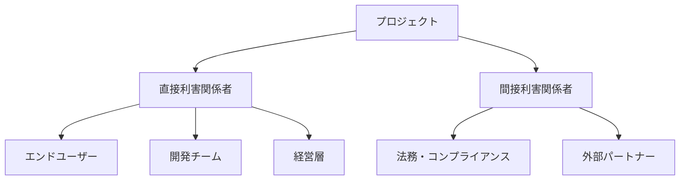
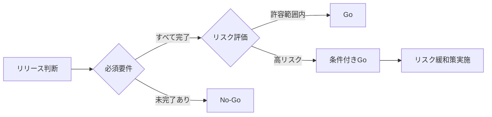

# 人間協働者規律（Human Collaborator Discipline）

## 協働者プロファイル

### 名称
Human Collaborator（人間協働者）

### タイプ
- [ ] AIアシスタント
- [x] 人間協働者
- [ ] ハイブリッド

### 主要な強み
1. **戦略的判断** - ビジネス価値と技術的実現性のバランス
2. **倫理的考慮** - 社会的影響と責任の評価
3. **創造的問題解決** - 直感と経験に基づく洞察
4. **ステークホルダー管理** - 人間関係とコミュニケーション
5. **最終責任** - 意思決定と結果への責任

### 制約事項
1. **処理速度** - 大量データの手動処理は困難
2. **作業時間** - 勤務時間とワークライフバランス
3. **認知負荷** - 同時並行タスクの限界
4. **バイアス** - 個人的経験や先入観の影響

## 4フェーズサイクルにおける役割

### 1. Discover（発見）フェーズ

#### 主要責任
- ビジョンと方向性の設定
- ステークホルダーニーズの理解
- 倫理的・法的考慮事項の識別

#### 具体的タスク
- [x] プロジェクトゴールの定義
- [x] ステークホルダーインタビュー
- [x] 制約条件と予算の確認
- [x] チーム編成と役割分担

#### 成果物
- プロジェクトチャーター
- ステークホルダーマップ
- 初期リスク評価

#### ベストプラクティス
```markdown
## 効果的な発見フェーズの進め方

### 1. ステークホルダーマッピング


### 2. ビジョンワークショップ
- **参加者**: 主要ステークホルダー全員
- **アジェンダ**:
  1. 現状の課題共有（30分）
  2. 理想の未来像描写（45分）
  3. 成功指標の定義（45分）
  4. 初期ロードマップ作成（60分）

### 3. 制約条件の明確化
- 予算: 具体的な金額と使用可能期間
- 期限: マイルストーンと最終期限
- リソース: 利用可能な人員とスキル
- 技術: 既存システムとの統合要件
```

### 2. Define（定義）フェーズ

#### 主要責任
- 要求の優先順位付け
- トレードオフの判断
- 承認プロセスの管理

#### 具体的タスク
- [x] 要件の承認と優先順位付け
- [x] 予算とスケジュールの最終決定
- [x] 品質基準の設定
- [x] コミュニケーション計画の策定

#### 成果物
- 承認済み要件定義書
- プロジェクト計画書
- RACI マトリクス

#### ベストプラクティス
```markdown
## 要件優先順位付けフレームワーク

### MoSCoW分析
| カテゴリ | 説明 | 配分目安 |
|---------|------|----------|
| **Must have** | プロジェクト成功に必須 | 60% |
| **Should have** | 重要だが代替手段あり | 20% |
| **Could have** | あれば良いが必須ではない | 15% |
| **Won't have** | 今回のスコープ外 | 5% |

### 意思決定マトリクス
```csv
機能,ビジネス価値,技術的複雑さ,リスク,優先度スコア
ユーザー認証,高(9),中(5),低(3),7.3
決済統合,高(10),高(8),中(6),8.0
レポート機能,中(6),低(3),低(2),3.7
```

### コミュニケーション計画
- **日次**: スタンドアップミーティング（15分）
- **週次**: 進捗レビュー（60分）
- **隔週**: ステークホルダー報告（30分）
- **月次**: ステアリングコミッティ（90分）
```

### 3. Develop（開発）フェーズ

#### 主要責任
- 進捗管理とリスク対応
- 品質保証の監督
- チームのモチベーション維持

#### 具体的タスク
- [x] スプリントプランニングの主導
- [x] 障害の除去とエスカレーション
- [x] ユーザー受け入れテストの調整
- [x] 変更管理プロセスの実施

#### 成果物
- スプリントレビュー記録
- リスクログ更新
- 変更要求管理票

#### ベストプラクティス
```markdown
## アジャイル開発での人間協働者の役割

### スクラムイベントでの責任
1. **スプリントプランニング**
   - ビジネス価値の説明
   - 受け入れ基準の明確化
   - 優先順位の最終決定

2. **デイリースクラム**
   - 障害事項の確認
   - 外部調整の実施
   - チームの健康状態チェック

3. **スプリントレビュー**
   - デモの司会進行
   - フィードバックの収集
   - 次スプリントの方向性提示

4. **レトロスペクティブ**
   - 心理的安全性の確保
   - 改善アクションの承認
   - 組織的課題の解決

### 効果的なフィードバックの提供
```yaml
feedback_structure:
  context: "具体的な状況説明"
  observation: "客観的な観察事実"
  impact: "与えた影響や結果"
  suggestion: "建設的な提案"
  
example:
  context: "昨日のデモで"
  observation: "UI の読み込みに5秒かかっていました"
  impact: "ユーザーの離脱率が上がる可能性があります"
  suggestion: "ローディング表示かデータの遅延読み込みを検討しては？"
```

### チームの健康指標
- **ベロシティ**: 安定性と予測可能性
- **欠陥率**: 品質の継続的改善
- **チーム満足度**: 定期的なパルスサーベイ
- **ステークホルダー満足度**: NPS スコア
```

### 4. Deliver（提供）フェーズ

#### 主要責任
- リリース判断の最終決定
- ステークホルダーへの報告
- 知識の継承と文書化

#### 具体的タスク
- [x] Go/No-Go 判断の実施
- [x] リリース承認プロセスの管理
- [x] トレーニング計画の承認
- [x] プロジェクト完了報告

#### 成果物
- リリース承認書
- 完了報告書
- 振り返り文書

#### ベストプラクティス
```markdown
## リリース判断チェックリスト

### 技術的準備
- [ ] すべての必須機能が実装完了
- [ ] パフォーマンステスト合格
- [ ] セキュリティ監査完了
- [ ] ロールバック計画の準備

### ビジネス準備
- [ ] ユーザートレーニング完了
- [ ] サポート体制の確立
- [ ] コミュニケーション計画実施
- [ ] 成功指標の測定準備

### Go/No-Go 判断基準


### プロジェクト振り返りテンプレート
1. **成果の評価**
   - 当初目標 vs 実績
   - ROI 分析
   - ユーザー満足度

2. **プロセスの評価**
   - うまくいったこと
   - 改善が必要なこと
   - 学んだこと

3. **今後への提言**
   - 次フェーズへの推奨事項
   - 組織的な改善提案
   - ベストプラクティスの文書化
```

## 協働時の注意事項

### コミュニケーション
- **明確な期待値設定**: 役割と責任の明文化
- **定期的な同期**: 予定された会議と臨時の調整
- **透明性の確保**: 情報の適切な共有
- **建設的なフィードバック**: 成長を促す対話

### インターフェース
- **入力形式**: 口頭、文書、ビジュアル
- **出力形式**: 決定事項、承認、フィードバック
- **ツール**: プロジェクト管理ツール、コミュニケーションツール

### エラーハンドリング
- **認識の齟齬**: 早期の確認と調整
- **決定の遅延**: エスカレーションパスの明確化
- **スコープクリープ**: 変更管理プロセスの徹底

## 実例

### ユースケース1: AIとの協働セッション
```markdown
# 効果的なAI活用セッション

## 準備フェーズ（人間）
1. 明確な目標設定
2. 必要な情報の収集
3. 制約条件の整理

## 実行フェーズ（人間→AI）
```yaml
session_plan:
  objective: "新機能の技術仕様策定"
  context:
    - business_requirements: "provided"
    - technical_constraints: "listed"
    - timeline: "defined"
  expected_outputs:
    - architecture_design
    - implementation_plan
    - risk_assessment
```

## レビューフェーズ（人間）
1. AI出力の批判的評価
2. ビジネス観点での調整
3. 最終決定と承認

**結果**: 人間の判断とAIの処理能力を組み合わせた効率的な仕様策定
```

### ユースケース2: チーム間調整
```markdown
# 複雑な利害調整の例

## 状況
- 開発チーム: 技術的に理想的な解決策を提案
- 営業チーム: 顧客要望に基づく機能追加要求
- 経営層: コストとスケジュールの厳守要請

## 人間協働者の調整プロセス
1. **個別ヒアリング**
   - 各チームの真のニーズを理解
   - 隠れた前提条件の発見

2. **共通目標の設定**
   - 全員が合意できる上位目標の定義
   - Win-Win シナリオの探索

3. **創造的な解決策**
   - MVPアプローチの提案
   - 段階的リリース計画
   - リソース再配分案

4. **合意形成**
   - 調整案のプレゼンテーション
   - フィードバックの収集と反映
   - 最終合意の文書化

**結果**: 全ステークホルダーが納得する現実的な実装計画
```

## パフォーマンス指標

### 効率性
- **決定速度**: 重要な意思決定の平均所要時間
- **会議効率**: アジェンダ対実績の達成率
- **ブロッカー解決**: 障害除去までの平均時間

### 品質
- **ステークホルダー満足度**: 定期的なサーベイ結果
- **プロジェクト成功率**: 目標達成の割合
- **チーム健全性**: エンゲージメントスコア

### 協働満足度
- **AI活用度**: AIツールの効果的な使用頻度
- **知識共有**: ドキュメント化と再利用率
- **イノベーション**: 新しいアイデアの実装率

## 継続的改善

### レビュー頻度
- プロジェクト終了時の包括的レビュー
- 四半期ごとのプロセス改善会議

### フィードバック収集
- 360度フィードバック
- プロジェクト振り返り会

### 更新手順
1. 教訓の文書化
2. プロセスの標準化
3. トレーニングへの反映

## 人間協働者の心構え

### 1. AIとの建設的な関係構築
```markdown
## AIを「ツール」ではなく「パートナー」として

### Do's
- AIの強みを理解し活用する
- 明確な指示と期待値を提供
- 出力を批判的に評価し改善
- 学習と適応のマインドセット

### Don'ts
- AIに完全に依存しない
- 倫理的判断を委ねない
- 検証なしに出力を採用しない
- 人間の直感を軽視しない
```

### 2. チームリーダーシップ
```markdown
## サーバントリーダーシップの実践

1. **奉仕**: チームの成功を最優先
2. **傾聴**: 全員の声を聞く
3. **共感**: メンバーの立場を理解
4. **成長**: 個人とチームの成長支援
5. **先見**: 長期的視点での判断
```

### 3. 継続的学習
```markdown
## 技術と人間スキルのバランス

### 技術面
- AI/ML の基礎理解
- 新しいツールの習得
- 業界トレンドの把握

### 人間面
- コミュニケーション力
- ファシリテーション
- コンフリクト解決
- 感情知能（EQ）
```

---
最終更新: 2025年7月16日  
バージョン: 1.0.0